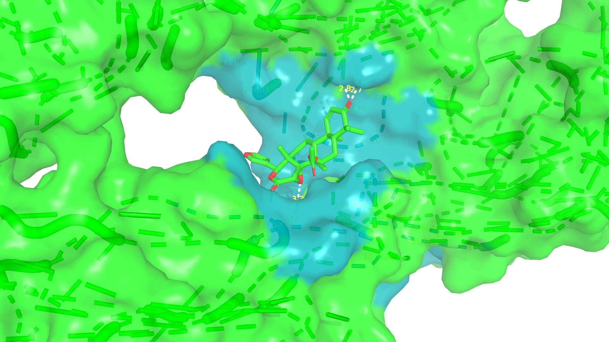
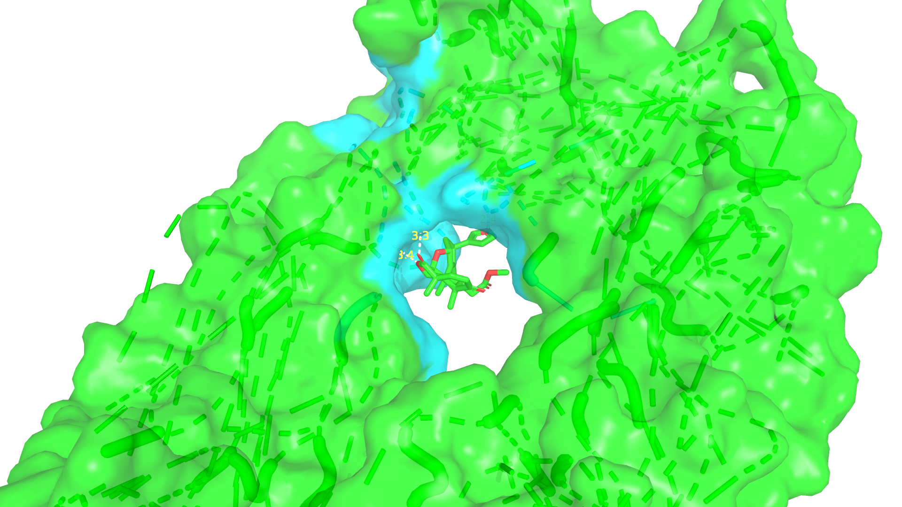
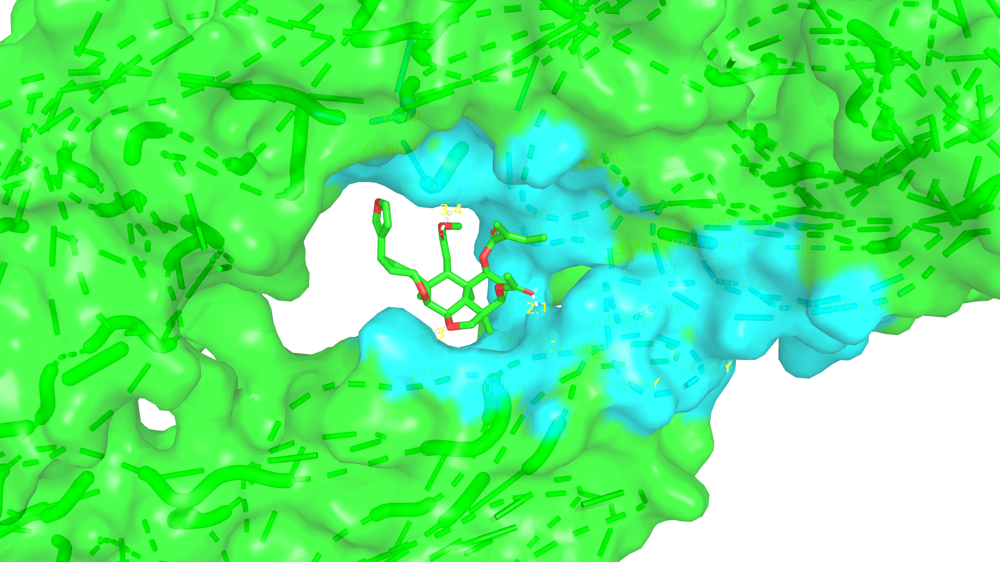
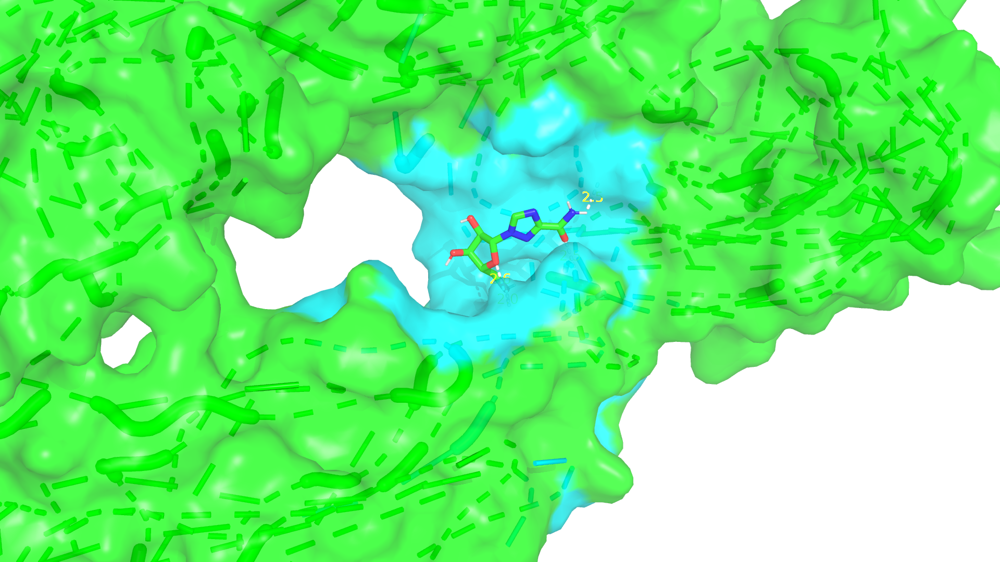
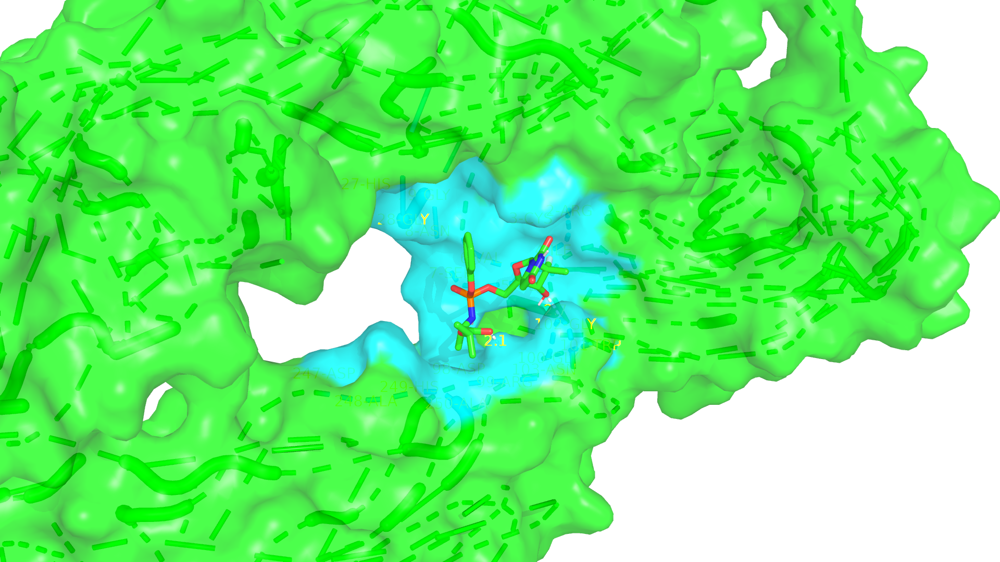

### Molecular Docking Project
# Neem Compounds and Benchmark Drugs Against Zika Virus Protease (5JHM)

This repository presents the molecular docking results of neem-derived compounds and FDA-approved drugs (ribavirin, sofosbuvir) against the Zika virus NS2B-NS3 protease (PDB: 5JHM). All docking runs were performed with AutoDock Vina.

---

## Table of Contents

- [Background](#background)
- [Project Structure](#project-structure)
- [Docking Workflow](#docking-workflow)
- [Results Summary](#results-summary)
- [How to View the Results](#how-to-view-the-results)
- [Software and References](#software-and-references)
- [Contact](#contact)

---

## Background

Zika virus (ZIKV) is a mosquito-borne flavivirus associated with serious neurological complications. Neem (Azadirachta indica) phytochemicals are known for broad-spectrum antiviral effects. This project evaluates the potential of selected neem compounds—**gedunin, nimbolide, salannin**—compared to **ribavirin** and **sofosbuvir** against the Zika virus NS2B-NS3 protease using molecular docking.

---

## Project Structure

```
neem-zika-docking/
│
├── data/ # Source ligand and protein structures (.sdf, .pdb, .pdbqt)
├── Proteins/ # Prepared protein .pdbqt files
├── Ligands/ # Prepared ligand .pdbqt files
├── Docking_Files/ # Docking configs, logs, outputs
├── Results/ # Docked pose and interaction visualizations
├── notes.txt # Project notes and observations
├── README.md # This file
```
---

## Docking Workflow

1. **Ligand and Protein Preparation:**  
   Ligands and protein targets were prepared in .pdbqt format using Open Babel and AutoDockTools.

2. **Docking:**  
   Docking was performed using AutoDock Vina, with consistent grid parameters and exhaustiveness.

3. **Analysis:**  
   Best binding affinity for each ligand was recorded from the first docking mode (`mode 1` in each log file).

4. **Visualization:**  
   Protein-ligand interactions were visualized and exported as PNG images.

---

## Results Summary

| Protein (PDB) | Ligand      | Best Binding Energy (kcal/mol) | Docked Pose Image          |
|:-------------:|:-----------:|:------------------------------:|:---------------------------|
| 5JHM          | Gedunin     |           **-7.6**             |       |
| 5JHM          | Nimbolide   |           **-7.0**             |   |
| 5JHM          | Salannin    |           **-6.4**             |     |
| 5JHM          | Ribavirin   |           **-6.0**             |   |
| 5JHM          | Sofosbuvir  |           **-8.3**             |  |

*Binding energies are from AutoDock Vina, lower (more negative) values indicate stronger predicted binding.*

---

## How to View the Results

- Detailed log files for each ligand are found in `Docking_Files/` (e.g., `gedunin_log.txt`)
- Visualization images are in `Results/`, showing the docked pose of each ligand with the Zika protease
- All input structures and configurations are included for reproducibility

---

## Software and References

- **AutoDock Vina**: O. Trott & A. J. Olson, J. Comput. Chem. 31 (2010) 455-461, [DOI:10.1002/jcc.21334](https://doi.org/10.1002/jcc.21334)
- **Protein Data Bank**: [5JHM](https://www.rcsb.org/structure/5JHM)
- **Preparation/Visualization**: Open Babel, AutoDockTools, PyMOL

---

## Contact

**Author:** Siddharth K. Nagaraj  
**Email:** siddharth.nagaraj@gmail.com  
**LinkedIn:** [Add your profile link here]

---


